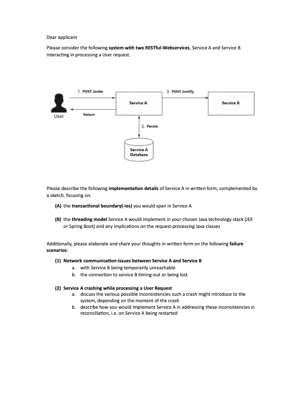
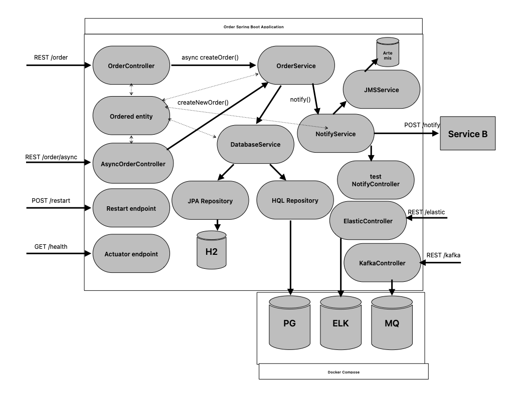

## Environment
- Java version: 17
- Maven version: 3.*
- Spring Boot version: 3.0.6

## Case study


## Case study sketch


## Data
Example of a Ordered data JSON object:
```json
{
    "id":1,
       
    "quantity":"6",
    
    "product":"WordPress"
}
```

## Implementation details
Implementation details focused on:

* Transactional boundaries are span across [DatabaseService implementation class](https://github.com/dhajtman/casestudy-api/blob/master/src/main/java/com/casestudy/api/service/impl/DefaultDatabaseService.java) and configured per method similar to
```java
@Transactional(readOnly = false, propagation= Propagation.REQUIRED, isolation = Isolation.REPEATABLE_READ)
    public Ordered createNewOrder(Ordered ordered) {
    return orderRepository.save(ordered);
}
```
In case above logical transaction is enforced per method and isolation level prevents prevents dirty, and non-repeatable reads.
If highest level of isolation and physical transaction per method is required below settings can be applied
```java
@Transactional(readOnly = false, propagation= Propagation.REQUIRED_NEW, isolation = Isolation.SERIALIZABLE)
    public Ordered createNewOrder(Ordered ordered) {
    return orderRepository.save(ordered);
}
```
This setting helps when crash might introduce to the system in various moments but will affect performance.

Idempotent NotifyService implementation with retry and recover logic
```java
    @Override
    @Retryable(retryFor = {NotifyServiceUnreachableException.class, NotifyServiceTimeoutException.class})
    public ResponseEntity<String> orderNotify() {
        List<Ordered> unnoticedOrders = databaseService.getUnnoticedOrders();

        for (Ordered ordered: unnoticedOrders) {
            HttpEntity<Ordered> request = new HttpEntity<>(ordered);
            String url = environment.getProperty("notify-service.url", "http://localhost:8000/notify");

            restTemplate.exchange(url, HttpMethod.POST, request, String.class);
            databaseService.updateOrderNotified(ordered);
        }
        return ResponseEntity.ok().build();
    }

    @Recover
    public ResponseEntity<String> notifyFailed(Ordered ordered) {
        logger.error("Notify failed");
        return ResponseEntity.unprocessableEntity().build();
    }
```

There are multiple clients to call Notification service, RestTemplate, RestClient and JMS.

* Threading model used are simple asynchronous methods in [OrderService implementation class](https://github.com/dhajtman/casestudy-api/blob/master/src/main/java/com/casestudy/api/service/impl/DefaultOrderService.java) configured per method similar to
```java
@Async
public void createNewOrder(Ordered ordered) throws InterruptedException {
    Thread.sleep(1000); // simulating long term operation
    Ordered created = databaseService.createNewOrder(ordered);
    ResponseEntity<String> response = notifyService.notify();
}
```
We've customized the ThreadPoolTaskExecutor with specific values for core pool size, maximum pool size, and task queue capacity.
Adjusting these values based on your application's requirements and available resources is required.
```java
@Bean(name = "asyncExecutor")
public Executor getAsyncExecutor() {
    ThreadPoolTaskExecutor executor = new ThreadPoolTaskExecutor();
    executor.setCorePoolSize(3); // Set the core pool size
    executor.setMaxPoolSize(10); // Set the maximum pool size
    executor.setQueueCapacity(25); // Set the capacity of the task queue
    executor.setThreadNamePrefix("custom-async-"); // Set the thread name prefix
    executor.initialize();
    return executor;
}
```

If RuntimeException is thrown during async processing liveness and readiness state is updated in CustomAsyncExceptionHandler class
```java
    @Override
    public void handleUncaughtException(final Throwable throwable, final Method method, final Object... obj) {
        logger.warn("Exception message - {}", throwable.getMessage());

        for (final Object param : obj) {
            logger.warn("Param - {}", param);
        }

        if (throwable instanceof RuntimeException) {
            AvailabilityChangeEvent.publish(this.eventPublisher, throwable, LivenessState.BROKEN);
            AvailabilityChangeEvent.publish(this.eventPublisher, throwable, ReadinessState.REFUSING_TRAFFIC);
        }
    }
```

* Network communication issues between Service A and Service B are handled with [custom implementation of ResponseErrorHandler](https://github.com/dhajtman/casestudy-api/blob/master/src/main/java/com/casestudy/api/rest/RestTemplateResponseErrorHandler.java)
using custom implemented client ([NotifyServiceTimeoutException](https://github.com/dhajtman/casestudy-api/blob/master/src/main/java/com/casestudy/api/exception/NotifyServiceTimeoutException.java)) and server ([NotifyServiceUnreachableException](https://github.com/dhajtman/casestudy-api/blob/master/src/main/java/com/casestudy/api/exception/NotifyServiceUnreachableException.java)) exceptions
and processed by Spring Boot Retry mechanism in [NotifyService implementation class](https://github.com/dhajtman/casestudy-api/blob/master/src/main/java/com/casestudy/api/service/impl/DefaultNotifyService.java)
```java
@Retryable(retryFor = {NotifyServiceUnreachableException.class, NotifyServiceTimeoutException.class})
public ResponseEntity<String> notify(Ordered ordered) {
    HttpEntity<Ordered> request = new HttpEntity<>(ordered);
    String url = environment.getProperty("notify-service.url", "http://localhost:8000/notify");
    return restTemplate.exchange(url, HttpMethod.POST, request, String.class);
}

@Recover
public ResponseEntity<String> notifyFailed(Ordered ordered) {
    logger.error("Notify failed");
    return ResponseEntity.unprocessableEntity().build();
}
```

* Service A crashing while processing a User Request

Various possible inconsistencies system failure may introduce could be handled by highest level of isolation and physical transaction per method. 

Monitoring Service A could be achieved by Spring Boot Actuator endpoints, for example by activating liveness and readiness endpoints in [application.yml](https://github.com/dhajtman/casestudy-api/blob/master/src/main/resources/application.yml)
```yaml
management:
  endpoints:
    web:
      exposure:
        include: health,info,metrics
      base-path: /actuator
  endpoint:
    health:
      probes:
        enabled: true
      show-details: always
  health:
    livenessState:
      enabled: true
    readinessState:
      enabled: true
```
These endpoints can be used for kubernetes liveness and readiness probes
```yaml
livenessProbe:
  httpGet:
    path: /actuator/health/liveness
    port: 8000
    initialDelaySeconds: 3
    periodSeconds: 3
```
Service A can also be monitored and restarted by separate service with exposed [RestartController](https://github.com/dhajtman/casestudy-api/blob/master/src/main/java/com/casestudy/api/controller/RestartController.java) restartApp method.

When running Service A like Linux service it can be restarted by Linux underlying operating system automatically in case of failure.

New Linux service created in `/etc/systemd/system`
```
[Unit]
Description=Application #use your application name

[Service]
User=root #use user with restricted permissions
Type=simple
ExecStart=/usr/bin/java -jar /path/to/jar #change java path and application path
Restart=always

[Install]
WantedBy=multi-user.target
```

## Implemented APIs
Assume there is ordered database and you want to create a REST API to access them.

Base on case study were implemented `/order` REST endpoint.

`POST` request to `/order`:
* create order

`GET` request to `/order/{id}`:
* return the order with given id

`DELETE` request to `/ordered/{id}`:
* delete the order with give id

`Test writing`

In addition to implementing the REST endpoints, were written unit and [functional tests](https://github.com/dhajtman/casestudy-api/blob/master/case_study_bruno_requests.json).

## Commands
- run: 
```bash
mvn clean spring-boot:run
```
- install: 
```bash
mvn clean install
```
- test: 
```bash
mvn clean test
```
- docker build image:
```bash
docker build -t case-study-docker . 
```
- docker run detached image:
```bash
docker run -d -p 8000:8000 case-study-docker:latest
```